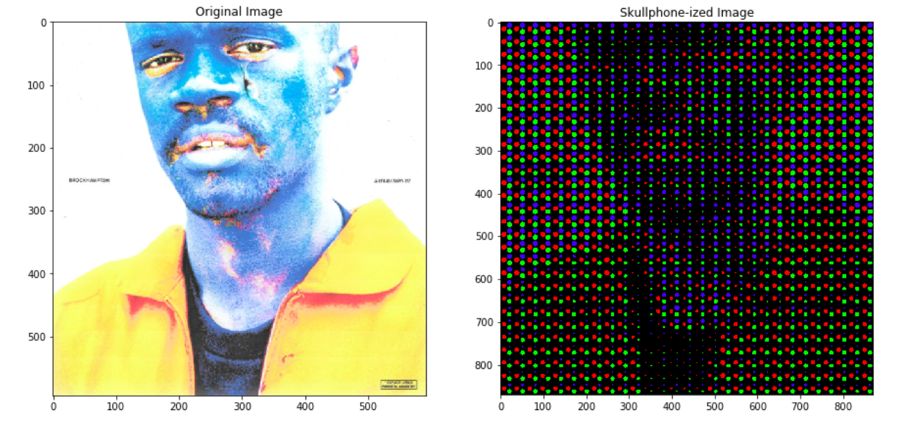

[](https://travis-ci.org/eridgraves/skullphone-izer)

# skullphone-izer
Make images into the style of Skullphone's "digital media painting" artwork.


Here is an example of the current input/output of the notebook:


## Usage:
**In Terminal:**
- Place image and skullphonize_image.py in the same directory.
- Run the script with python (requires NumPy, OpenCV2, MatPlotLib, PIL, sys, os), with the image and scale as arguments:
    ```python skullphonize_image.py [str IMAGE_NAME] [int SCALE]```
- If a readable image is given, MatPlotLib will open a window showing input and output images side-by-side. The output image will also be saved to the cwd under the same name with scale appended.
- Errors will be printed to the terminal.

**In Jupyter:**
- Just open and run the notebook cell-by-cell. This is the easiest way to see how the code works.

## TODO:
- Write tests. ***How do you write tests for image processing scripts?***
- Build out GUI for input/output?
- ~~Move to webapp (Docker based?)~~ (shelved 2/21)
- Expand to process video in real-time (ish). Use to build a "mirror".
